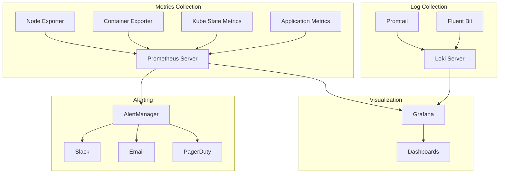

# Enterprise Monitoring Stack

<p align="center">
  
  
  
  
</p>

> **Full observability platform** featuring Prometheus metrics collection, Grafana visualization, Loki log aggregation, AlertManager notification routing, and pre-configured dashboards for Kubernetes, Docker, and application monitoring.

## Architecture



## Features

- **Prometheus**: Metrics collection with ServiceMonitor CRDs
- **Grafana**: Pre-built dashboards for K8s, Docker, NGINX, applications
- **Loki**: Log aggregation with Promtail agents
- **AlertManager**: Multi-channel alerting (Slack, Email, PagerDuty)
- **Node Exporter**: Host-level system metrics
- **Blackbox Exporter**: Endpoint probing and synthetic monitoring

## Quick Start

```bash
# Deploy monitoring stack
kubectl apply -k kubernetes/

# Access Grafana
kubectl port-forward svc/grafana 3000:3000 -n monitoring
# Open http://localhost:3000 (admin/admin)
```

## Components

| Component | Version | Purpose |
|-----------|---------|---------|
| Prometheus | v2.49 | Metrics storage & query |
| Grafana | v10.3 | Visualization dashboards |
| Loki | v2.9 | Log aggregation |
| AlertManager | v0.26 | Alert routing |
| Node Exporter | v1.7 | Host metrics |
| Blackbox Exporter | v0.24 | Endpoint probing |

## Related

- [enterprise-kubernetes-platform](https://github.com/balvantvishwakarma/enterprise-kubernetes-platform) — Monitors this K8s platform
